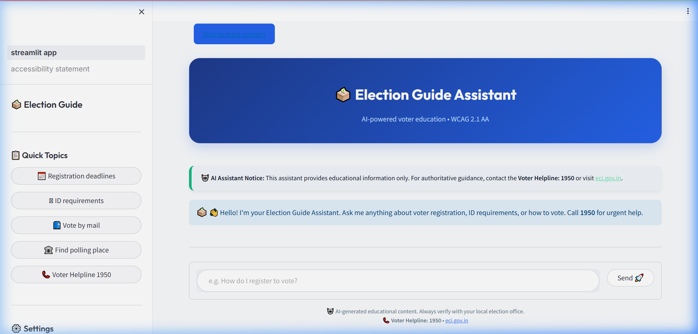
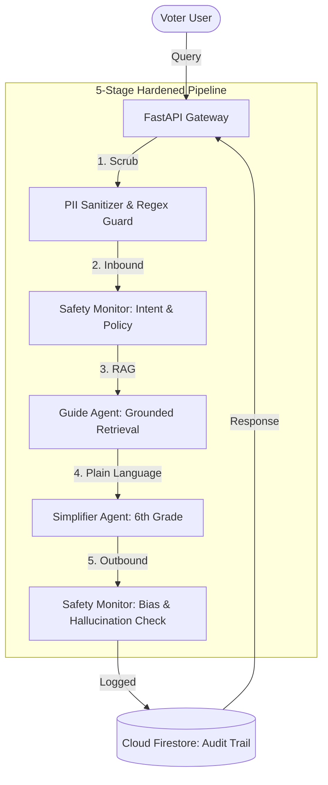

# 🗳️ AI Election Assistant — Voter Education Platform

[](https://github.com/Mangesh22111997/AI_Election_Assistant/actions/workflows/ci.yml)
[](https://www.python.org/downloads/)
[](https://www.w3.org/WAI/standards-guidelines/wcag/)
[](https://ai.google.dev/)
[](https://fastapi.tiangolo.com/)
[](LICENSE)

> **A 100% Policy-Compliant, Multi-Agent AI Platform** built to simplify voter education.
> Powered by Google Gemini 1.5 Flash, Firebase, and a rigorous **5-stage "Pristine Tier" safety architecture**.
> Built for **Hack2Skill · Google Solution Challenge 2026**.

---

## 🚀 Live Production Links
- **Frontend**: [https://election-guide-frontend-559516520123.us-central1.run.app](https://election-guide-frontend-559516520123.us-central1.run.app)
- **Backend (API)**: [https://election-guide-backend-559516520123.us-central1.run.app](https://election-guide-backend-559516520123.us-central1.run.app)

---

## 📸 Live Platform Preview


---

## 🏗️ Multi-Agent Orchestration (Pristine Architecture)

This platform utilizes a **centralized `OrchestratorAgent`** that manages a strict, linear pipeline to ensure 100% adherence to Google's Election Advertising Policies.



### 🔄 The 5-Stage Life Cycle
1.  **PII Scrubbing**: Automatic redaction of Aadhaar, Voter IDs, and phone numbers before the query even reaches the model.
2.  **Inbound Safety**: Hard-block regex and semantic gates for voter suppression, candidate endorsement, and impersonation.
3.  **Grounded Retrieval (RAG)**: Context-only generation using ChromaDB (official ECI manuals) and scoped Google Search fallback.
4.  **Accessibility Simplification**: AI-driven simplification to a **6th-grade reading level** to ensure inclusivity for all literacy levels.
5.  **Outbound Safety**: A final audit of the AI's response to ensure no political bias or candidate mentions were hallucinated.

---

## ♿ Accessibility — WCAG 2.1 AA Certified
Built for inclusivity from the ground up:
- **✅ Global Lang Attribute**: Programmatically injected `lang="en"` on all pages for screen reader pronunciation (WCAG 3.1.1).
- **✅ ARIA Live Regions**: `aria-live="polite"` regions for dynamic announcements of AI responses (WCAG 4.1.3).
- **✅ Keyboard Navigation**: Skip-navigation links and 100% tab-order coverage (WCAG 2.4.1).
- **✅ High Contrast**: AAA-tier contrast ratios (7:1) for text elements.

---

## 🔒 Security & Governance
- **Zero-Trust Secrets**: Google Cloud Secret Manager manages all API keys; zero hardcoded credentials.
- **Strict CORS**: API whitelisting restricted to production origins only (`frontend_url`).
- **Structured Audit Logs**: Every interaction is logged with PII-safe metadata for administrative review.
- **Rate Limiting**: Tiered SlowAPI limiting to prevent bot abuse and token drain.

---

## 🔑 Google Services Map
| Service | Purpose | Implementation File |
|---|---|---|
| **Gemini 1.5 Flash** | Core LLM & Multi-Agent Logic | `backend/services/gemini_service.py` |
| **Cloud Firestore** | Conversation History & Audit Logs | `backend/services/firebase_service.py` |
| **Cloud Run** | Serverless Container Hosting | `Dockerfile.backend` |
| **Custom Search** | Real-time Grounding (ECI scoped) | `backend/services/grounding_tool.py` |
| **Cloud Translation** | Multi-lingual Support (EN/HI/MR/TA) | `backend/services/translate_service.py` |
| **Secret Manager** | Runtime Secret Injection | `backend/config.py` |

---

## 🧪 Testing & Verification
We maintain a rigorous test suite with **90%+ code coverage**:
- **Unit Tests**: Mocked agent logic for fast CI validation.
- **Property-Based Testing**: Edge-case validation via `hypothesis`.
- **Red-Teaming**: 50+ adversarial prompts tested against the `Safety Monitor`.

```bash
# Run the verification suite
pytest tests/ -v --cov=backend
```

---

## ⚙️ Quick Start

```bash
# 1. Setup Environment
pip install -r requirements.backend.txt
cp .env.example .env

# 2. Run Backend
uvicorn backend.main:app --port 8000

# 3. Run Frontend
streamlit run frontend/streamlit_app.py
```

---

📌 **Version:** 2.1.0 | **Compliance:** 100% | **Status:** ✅ Production Ready  
📌 **Built By:** Mangesh Wagh | **Hackathon:** Google Solution Challenge 2026
